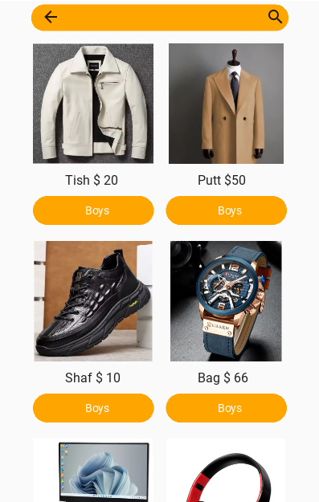
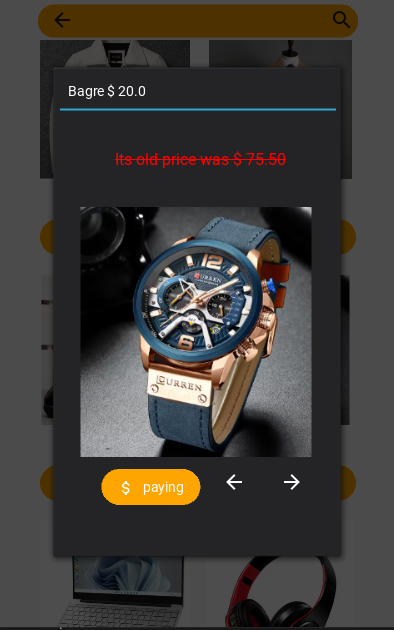
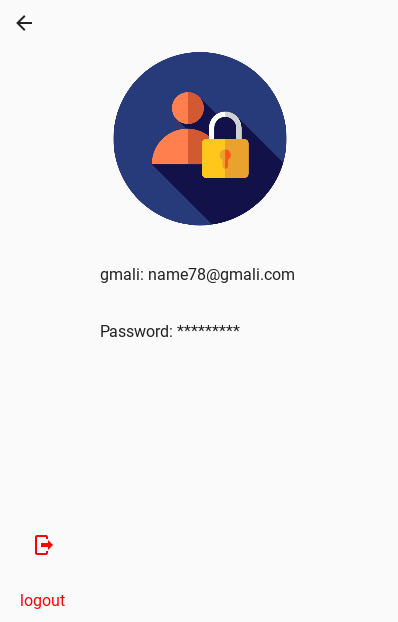

# 🛒 Marketing App

## 📌 About
A *high-quality marketing app* developed for easy use.  
It is designed to be:
- ✅ User-friendly and easy to navigate  
- ✅ Elegant design  
- ✅ Temporary storage of user data  
- ✅ Login and logout functionality  

---

## 🚀 Features
- User registration and login  
- Temporary data storage  
- Login or close the app  
- View product images from all angles  
- Market map integration  
- Add an electronic card  

---

## 📷 Screenshots
| Screen 1 | Screen 2 |
|----------|----------|
|  |  |

| Screen 3 | Screen 4 |
|----------|----------|
|  |  |

| Screen 5 | Screen 6 |
|----------|----------|
|  |  |

---

## 🛠️ Technologies Used
- [Python 3](https://www.python.org/)  
- [Kivy](https://kivy.org/)  
- [KivyMD](https://kivymd.readthedocs.io/)  

